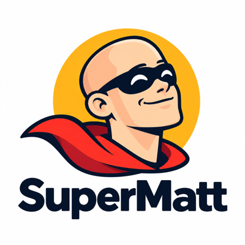
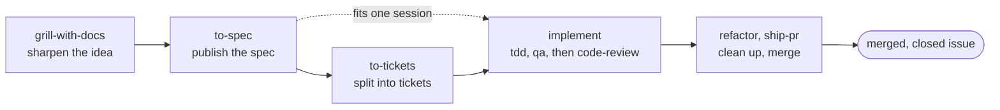

<p align="center">
  
</p>

<p align="center"><strong>The best of <a href="https://github.com/mattpocock/skills">Matt Pocock's Skills</a>, <a href="https://github.com/obra/superpowers">Superpowers</a>, and <a href="https://github.com/EveryInc/compound-engineering-plugin">Compound Engineering</a>.<br>One complete, simple, supercharged SDLC system for your coding agent.</strong></p>

<p align="center">
  <a href="https://github.com/svyatov/supermatt/actions/workflows/validate.yml"></a>
  <a href="https://github.com/svyatov/supermatt/releases/latest"></a>
  <a href="#install"></a>
  <a href="#install"></a>
  <a href="LICENSE"></a>
</p>

<p align="center">
  <a href="#install">Install</a> ·
  <a href="#where-to-start">Where to start</a> ·
  <a href="#engineering">Skills</a> ·
  <a href="#how-it-differs-from-mattpocockskills">How it differs</a> ·
  <a href="CHANGELOG.md">Changelog</a>
</p>

- **Claude Code and Codex.** Each host installs SuperMatt from its own native plugin marketplace.
- **39 skills.** 30 for engineering and 9 for productivity, listed below.
- **A second model reviews your changes.** `code-review` runs every axis twice, once in a sub-agent and once in `codex` from Claude Code (or `claude` from Codex) when that CLI is installed, and the model that did not raise a finding validates it. Upstream reviews on two axes.
- **One flow from idea to closed issue.** Forked from [mattpocock/skills](https://github.com/mattpocock/skills) at `c55ee46`, each skill checks its own work and hands the result to the next.

## Install

In Claude Code, type:

```text
/plugin marketplace add svyatov/supermatt
/plugin install supermatt@supermatt
```

In Codex, run:

```bash
codex plugin marketplace add svyatov/supermatt
codex plugin add supermatt@supermatt
```

Then, in the repository you work in, type this in Claude Code (`$setup-supermatt-skills` in Codex):

```text
/supermatt:setup-supermatt-skills
```

It asks where you track issues (GitHub, GitLab, or local Markdown files) and which triage labels to use, then writes:

```text
CLAUDE.md or AGENTS.md          "## Agent skills" section
docs/agents/issue-tracker.md    where issues live
docs/agents/triage-labels.md    label names for the triage roles
docs/agents/domain.md           where GLOSSARY.md and ADRs live
```

<details>
<summary>Claude Code's bundled <code>/code-review</code></summary>

Claude Code has a bundled `/code-review` skill with the same name as this plugin's `code-review`. Plugin skills are namespaced, so the plugin's review is `/supermatt:code-review`, and a bare `/code-review` runs the bundled one. To turn the bundled skill off, add this to `~/.claude/settings.json`:

```json
{ "skillOverrides": { "code-review": "off" } }
```

</details>

<details>
<summary>Linking skills for maintainers</summary>

Maintainers working on this repo can instead link every skill into `~/.claude/skills` and `~/.agents/skills` with `scripts/link-skills.sh`. Linked skills are not namespaced, so in Claude Code a linked `code-review` replaces the bundled `/code-review`.

</details>

## Where to start

Run `/supermatt:setup-supermatt-skills` once per repository, as above. After that, when you are not sure which skill fits, describe your situation to `/supermatt:ask-supermatt` and it names the skill or flow. In Codex, type `$name` for any skill below.

Most work follows the main flow:



1. `grill-with-docs` sharpens the idea by interview.
2. `to-spec` turns the conversation into a spec on your issue tracker.
3. `to-tickets` splits the spec into tickets. Skip it when the work fits in one session.
4. `implement` builds each ticket through `tdd`, checks it in the running program with `qa`, then closes it out with `code-review`.
5. `refactor` cleans up the branch without changing behavior, and `ship-pr` merges it once CI is green.

With triaged issues on GitHub, `orchestrate` runs steps 4 and 5 unattended for each issue in turn, in worker Claude Code sessions inside herdr.

## How it differs from mattpocock/skills

SuperMatt starts from [mattpocock/skills](https://github.com/mattpocock/skills) at commit `c55ee46` and keeps its idea: small, composable skills that stay under your control. The main change is that each skill checks its own work and hands the result to the next skill, so the set runs as one flow from an idea to a reviewed, closed issue.

### Skills check their own work

- `code-review` adds a third axis, **Adversarial**: how does the change fail in production? Its brief also runs security, public contract, migration, reliability, and concurrency checks on the parts of the diff they apply to. Every axis has two readers, a sub-agent and a second model (`codex` from Claude Code, `claude` from Codex), and a finding both raise is marked `[both]`. Findings carry P0-P3 severities and quote the lines they cite. The model that did not raise a P0, P1, or P2 finding validates it before the review ends with a verdict, and the Standards axis also checks that tests exercise the changed behavior. Upstream reviews on two axes, Standards and Spec.
- `to-spec` checks the draft spec in a fresh-context sub-agent before it publishes it.
- `tdd` checks that each test goes red for the reason it names, counts a cycle green only when the full suite passes, ends with a mutation check, and flags change-detector tests.
- `diagnosing-bugs` asks what you already tried, rules out the environment and uncommitted work, and fixes nothing until the causal chain has no gaps. It escalates to you after 2-3 dead hypotheses or 3 failed fixes.
- `improve-architecture` assesses the codebase first and stops when it is healthy. It finds hot spots by change count over the last year, maps the structure before it looks for friction, visits every module in the map, and skips modules that are shallow by design. `refactor` and `improve-tests` gate on an assessment the same way.
- `qa`, new in SuperMatt, runs the changed program the way its user would (a terminal program in tmux, a web app in a browser) and checks every requested behavior before `code-review` reads the code.
- `ideate`, new in SuperMatt, has a fresh sub-agent try to refute each idea before it ranks the survivors.

### Skills hand off to each other

- `implement` runs the full suite before every commit, runs `qa` in a fresh sub-agent and fixes every fail test-first, passes the spec to `code-review`, fixes the verified P0 and P1 findings, and closes each issue once the review is clean.
- `diagnosing-bugs` writes the regression test through `tdd` and reviews the fix with `code-review`, using the bug report as the spec.
- Test seams agreed in `to-spec` or `triage` travel through `to-tickets` into `implement` and `tdd`, so no skill asks about them twice.
- Each planning skill ends by pointing to the next step: `ideate` to `/grill-with-docs`, `improve-architecture` to `/to-spec` or `/implement`, and `wayfinder` to `/to-spec`.
- `orchestrate`, new in SuperMatt, chains `triage`, `implement`, `fix-findings`, `refactor`, `ship-pr`, and `retro` across fresh worker sessions, and verifies each spec with `qa` and `code-review` once its tickets close.
- `ask-supermatt` routes across all of these flows and is kept in sync with every skill change.

### Refactors keep behavior

- `implement` pins current behavior with characterization tests, written through `tdd` in their own `test:` commit.
- `refactor:` commits never touch test files, and `code-review` runs a refactor check on them.
- A review fix that changes behavior goes test-first.

### Smallest version first

- `grilling` offers the smallest option first and asks at most four questions a round, only ones that change what gets built.
- `wayfinder` names the smallest version before it charts the work, has a sub-agent argue for the smallest answer, and counts a map as done when the first working version can be built.

### Codex is a first-class host

- SuperMatt ships a native Codex plugin marketplace next to the Claude Code one. Upstream installs into Codex through `npx skills`, and lists a native Codex plugin on its roadmap.
- Skills live in a flat `skills/` directory, because Codex rejects nested skills.
- Wherever a skill tells you to run another user-invoked skill, it gives the Codex form (`$name`) next to the Claude Code form (`/name`).

### Scope and names

| Change | What |
|---|---|
| **Kept** | The engineering and productivity skills, plus `retro` and `pr` from upstream's in-progress set. |
| **Dropped** | Upstream's `misc` skills and the rest of its in-progress set. |
| **Added** | `ideate`, `qa`, `orchestrate`, `refactor`, `improve-tests`, `commit`, `ship-pr`, `fix-findings`, `what-would-you-do`, `jury`, and `dependency-vetting`. |
| **Renamed** | `ask-matt` is `ask-supermatt`, `improve-codebase-architecture` is `improve-architecture`, `setup-matt-pocock-skills` is `setup-supermatt-skills`, and `CONTEXT.md` is `GLOSSARY.md`. |

### Borrowed ideas

Some of the checks above are adapted from other skill sets:

| Source | Skills |
|---|---|
| [Every's compound-engineering plugin](https://github.com/EveryInc/compound-engineering-plugin) | `code-review`, `diagnosing-bugs`, `to-spec`, `ideate` |
| [Superpowers](https://github.com/obra/superpowers) | `tdd`, `diagnosing-bugs` |
| Luke Ramsden's [software-design](https://github.com/lukeramsden/software-design-agent-skill) | `codebase-design` |
| Dex Horthy's [show-me](https://github.com/humanlayer/skills/blob/main/plugins/show-me/skills/show-me/SKILL.md) | `pr` |
| GitHub's [awesome-copilot](https://github.com/github/awesome-copilot) refactor skills | `refactor` |
| Leonardo Flores's [reducing-entropy](https://github.com/softaworks/agent-toolkit/tree/main/skills/reducing-entropy) | `refactor` |

The full record of changes is in [CHANGELOG.md](./CHANGELOG.md).

## Engineering

### User-invoked

| Skill | What it does |
|---|---|
| **[ask-supermatt](./skills/ask-supermatt/SKILL.md)** | Ask which skill or flow fits your situation. A router over the skills in this repo. |
| **[grill-with-docs](./skills/grill-with-docs/SKILL.md)** | Grilling session that also builds your project's domain model, sharpening terminology and updating `GLOSSARY.md` and ADRs inline. |
| **[triage](./skills/triage/SKILL.md)** | Move issues and external PRs through a state machine of triage roles: categorise, verify, grill if needed, and write agent-ready briefs. |
| **[ideate](./skills/ideate/SKILL.md)** | Generate grounded ideas for what to build next, critique every one, and rank the survivors in a Markdown file, each with a prompt that takes it into `/grill-with-docs`. |
| **[improve-architecture](./skills/improve-architecture/SKILL.md)** | Assess a codebase's architecture and stop when it is healthy; otherwise map the structure, list deepening opportunities, grill and design the one you pick, and hand a plan to `/implement`. |
| **[refactor](./skills/refactor/SKILL.md)** | Refactor code at method, file, or project scope without changing behavior. Assesses first and stops when the code is clean, and gates edits on test coverage. |
| **[improve-tests](./skills/improve-tests/SKILL.md)** | Cut a test suite to the tests that catch real bugs and its run time to the minimum: measure first, delete or demote low-value tests, fix slow setup, and prove every cut keeps the checks that matter. |
| **[orchestrate](./skills/orchestrate/SKILL.md)** | Work through a repository's GitHub issues unattended, driving worker Claude Code sessions in herdr panes to verify specs, triage bugs, implement, refactor, and merge each issue, and store the lessons of each run in the repo. |
| **[commit](./skills/commit/SKILL.md)** | Commit all changes on the current branch, main included, after a scan for secrets. |
| **[ship-pr](./skills/ship-pr/SKILL.md)** | Commit, push, open a pull request, wait for green CI, then squash merge. |
| **[fix-findings](./skills/fix-findings/SKILL.md)** | Apply every finding from the most recent review, audit, verification, or check, at the root cause and without widening scope. |
| **[architecture-review](./skills/architecture-review/SKILL.md)** | Deprecated: use `improve-architecture`. SuperMatt 0.10.0 removes it. |
| **[setup-supermatt-skills](./skills/setup-supermatt-skills/SKILL.md)** | Configure this repo for the engineering skills (issue tracker, triage labels, domain doc layout). Run once per repo. |
| **[to-spec](./skills/to-spec/SKILL.md)** | Turn the current conversation into a spec and publish it to the issue tracker. |
| **[to-tickets](./skills/to-tickets/SKILL.md)** | Break any plan, spec, or conversation into a set of tracer-bullet tickets, each declaring its blocking edges, as text in one file per ticket locally or as native blocking links on a real tracker. |
| **[implement](./skills/implement/SKILL.md)** | Build the work described by a spec, tickets, or triaged issues, driving `/tdd` at pre-agreed seams, then committing, checking it with `/qa`, and closing out with `/code-review`. |
| **[retro](./skills/retro/SKILL.md)** | Run a retrospective on a coding session and get ranked suggestions for the agent's environment: automated checks, context pointers, coding-standards rules, stale or contradictory instructions, and a leaner `AGENTS.md`. |
| **[wayfinder](./skills/wayfinder/SKILL.md)** | Plan a huge chunk of work (more than one agent session can hold) as a shared map of decision tickets on the issue tracker, resolved one at a time until the way to the destination is clear. |
| **[wizard](./skills/wizard/SKILL.md)** | Deprecated, with no replacement. SuperMatt 0.7.0 removes it. |

### Model-invoked

| Skill | What it does |
|---|---|
| **[prototype](./skills/prototype/SKILL.md)** | Build a throwaway prototype to answer a design question: a single shareable HTML file for state/logic, or several toggleable UI variations. |
| **[diagnosing-bugs](./skills/diagnosing-bugs/SKILL.md)** | Disciplined diagnosis loop for hard bugs and performance regressions: build a feedback loop that goes red on this bug → minimise → hypothesise → instrument → fix → regression-test. |
| **[research](./skills/research/SKILL.md)** | Investigate a question against high-trust primary sources and capture the findings as a cited Markdown file in the repo, run as a background agent. |
| **[tdd](./skills/tdd/SKILL.md)** | Test-driven development with a red-green loop. Builds features or fixes bugs one vertical slice at a time. |
| **[domain-modeling](./skills/domain-modeling/SKILL.md)** | Actively build and sharpen a project's domain model by challenging terms, stress-testing with scenarios, and updating `GLOSSARY.md` and ADRs inline. |
| **[codebase-design](./skills/codebase-design/SKILL.md)** | Shared discipline and vocabulary for designing deep modules: small interfaces, clean seams, testable through the interface. |
| **[qa](./skills/qa/SKILL.md)** | QA a change in the running program before code review: write a scenario for every requested behavior, drive a terminal program through tmux or a web app through a browser, and report each scenario as pass, fail, or blocked with the evidence observed. |
| **[code-review](./skills/code-review/SKILL.md)** | Three-axis review of the diff since a fixed point: **Standards** (does it follow the repo's coding standards, plus a Fowler smell baseline?), **Spec** (does it faithfully implement the originating issue/spec?), and **Adversarial** (how does it fail in production?), each read in parallel by a sub-agent and by a second model, closed with a verdict. When Claude Code runs the review, the second model is `codex` if it is installed; when Codex runs it, the second model is `claude`. The model that did not raise a finding validates it. |
| **[pr](./skills/pr/SKILL.md)** | The shape of a pull request body: a summary diagram or diff sketch, before/after evidence, and the merge danger (one-way or two-way door, blast radius). |
| **[dependency-vetting](./skills/dependency-vetting/SKILL.md)** | Verify a package or tool is authentic before installing, adding, upgrading, or recommending it, by following the link from the upstream project to its install command. |
| **[resolving-merge-conflicts](./skills/resolving-merge-conflicts/SKILL.md)** | Work through an in-progress git merge or rebase conflict hunk by hunk, resolving by intent traced to each side's primary source, run the project's checks, then finish the operation, never `--abort`. |

## Productivity

### User-invoked

| Skill | What it does |
|---|---|
| **[grill-me](./skills/grill-me/SKILL.md)** | Get relentlessly interviewed about a plan or design until every branch of the design tree is resolved. |
| **[handoff](./skills/handoff/SKILL.md)** | Write the current conversation into a portable handoff document so another agent can continue the work. |
| **[teach](./skills/teach/SKILL.md)** | Teach the user a new skill or concept over multiple sessions, using the current directory as a stateful teaching workspace. |
| **[to-questionnaire](./skills/to-questionnaire/SKILL.md)** | Turn a decision you can't answer alone into a Markdown questionnaire for the one person who can (filled in async, or together over a meeting). |
| **[what-would-you-do](./skills/what-would-you-do/SKILL.md)** | Answer the agent's question with this one: it explains the problem, weighs each option, and recommends an answer. |
| **[jury](./skills/jury/SKILL.md)** | Put a hard decision to a jury of 3 or 5 subagents: blind votes, one anonymous review round, and one committed verdict with the dissent and the first action. |
| **[wait-what](./skills/wait-what/SKILL.md)** | Fire this the moment a message doesn't land. The agent re-pitches it with the context you're missing, in plain English, using your `GLOSSARY.md` vocabulary. |

### Model-invoked

| Skill | What it does |
|---|---|
| **[grilling](./skills/grilling/SKILL.md)** | Interview the user relentlessly about a plan, decision, or idea until every branch of the design tree is resolved. |
| **[writing-for-agents](./skills/writing-for-agents/SKILL.md)** | Writing documents for agents: skills, AGENTS.md/CLAUDE.md, and any doc an agent reaches by a pointer. |

## Help and status

Ask questions and report bugs in [GitHub issues](https://github.com/svyatov/supermatt/issues). Report a security vulnerability privately, as [SECURITY.md](./SECURITY.md) describes. [PRIVACY.md](./PRIVACY.md) lists where each skill sends your data. To send a change, read [CONTRIBUTING.md](./CONTRIBUTING.md).

SuperMatt is maintained by Leonid Svyatov. Fixes go to the latest release only.

## Authors

- Leonid Svyatov
- Matt Pocock, author of the original skills in [mattpocock/skills](https://github.com/mattpocock/skills)

## License

MIT. See [LICENSE](./LICENSE).
